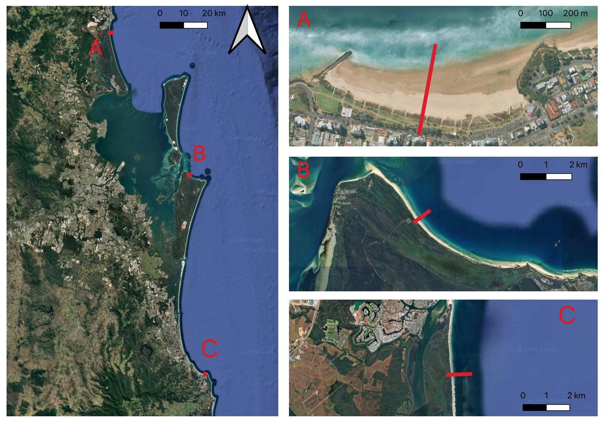

**Workshop #1 - Decadal Shoreline Change**

Click on the links below to get access to the practical material. You can watch the video first to get an idea of how to conduct the practicals.

**Menu**

[Workshop 1: Decadal Shoreline Change Notes](https://www.notion.so/Workshop-1-Chronic-Shoreline-Change-20f6f8acd3fa8007a8e2c7119cb22388?source=copy_link)

[Southeast Queensland Wave Data - Brisbane Deep Water Wave Buoy 1988 - 2019](assets/brisbane_waves_1988_2019.xlsx)

<!-- [People](./people.html)

[Research](./projects.html)

[Media and Publications](./publications.html)

[Datasets](./data.html)

[Teaching](./teaching.html)

[Available Honours and Masters Projects](./student_projects)

[Other interests](./other.html) -->

