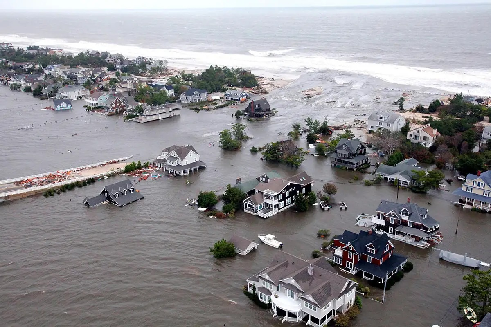
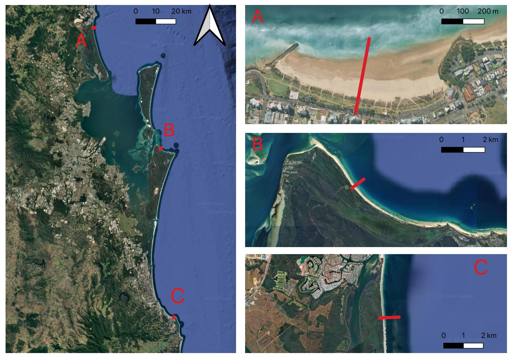
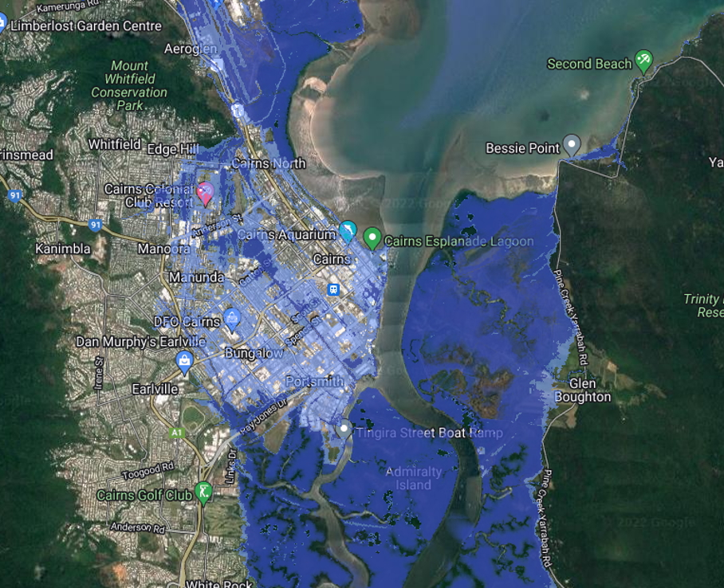

**Workshop #2 - Inundation mapping with real-world data**

Click on the links below to get access to the practical material. You can watch the video first to get an idea of how to conduct the practicals.

<!-- -->

**Links**

[Workshop 1: Inundation Hazard Workshop Notes]((https://www.notion.so/Workshop-2-Inundation-mapping-with-real-world-data-2106f8acd3fa8041bac5ff6f5859e313?source=copy_link))

[Canute 3.0](https://shiny.csiro.au/Canute3_0/)

[Coastal Risk Website](http://www.coastalrisk.com.au)

<!-- [People](./people.html)

[Research](./projects.html)

[Media and Publications](./publications.html)

[Datasets](./data.html)

[Teaching](./teaching.html)

[Available Honours and Masters Projects](./student_projects)

[Other interests](./other.html) -->

